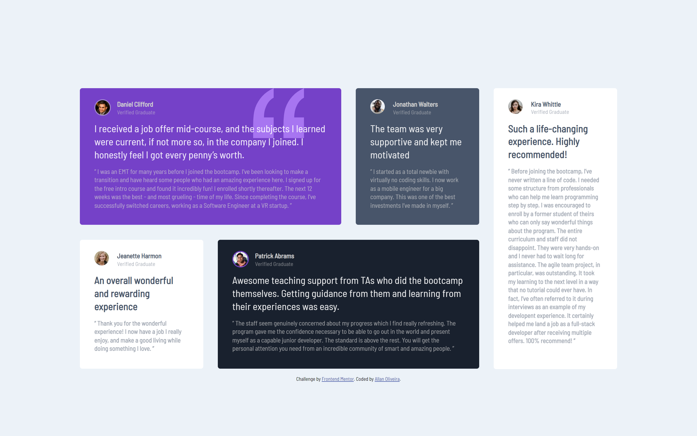
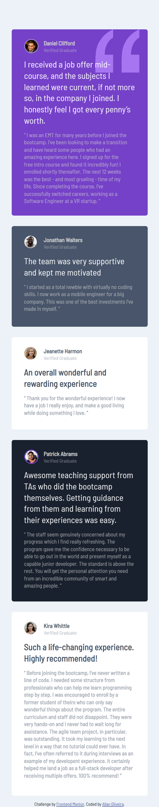

# Frontend Mentor - Testimonials grid section solution

This is a solution to the [Testimonials grid section challenge on Frontend Mentor](https://www.frontendmentor.io/challenges/testimonials-grid-section-Nnw6J7Un7). Frontend Mentor challenges help you improve your coding skills by building realistic projects. 

## Table of contents

- [The challenge](#the-challenge)
  - [Screenshot](#screenshot)
  - [Links](#links)
- [My process](#my-process)
  - [Built with](#built-with)
- [Author](#author)

### The challenge

- In this challenge, it was supposed to create a testimonial page, using the CSS grid tool, this way the page should be responsive and viewed on all types of devices.

### Screenshot

### Links

- [Solution](https://github.com/AllanSancley/testimonials-grid-section-main_Frontend.mentor.git)
- [Live Site](https://testimonialss-grid-frontend-mentor.netlify.app/)

## My process

- My process of building this page was relatively easy in some aspects, such as creating the testimonial articles, but I always have a little difficulty in terms of responsiveness, I created the home page for a mobile device, but when it comes to creating the site for a desktop device, I'm having trouble aligning the elements, but little by little I'm managing to develop the page.

### Built with

- Semantic HTML5 markup
- CSS custom properties
- Flexbox
- CSS Grid
- Mobile-first workflow

## Author

- Frontend Mentor - [@AllanSancley](https://www.frontendmentor.io/profile/AllanSancley)
- Github - [@AllanSancley](https://github.com/AllanSancley)
- Linkedin - [Allan Sancley](www.linkedin.com/in/allan-sancley-12b583193)
